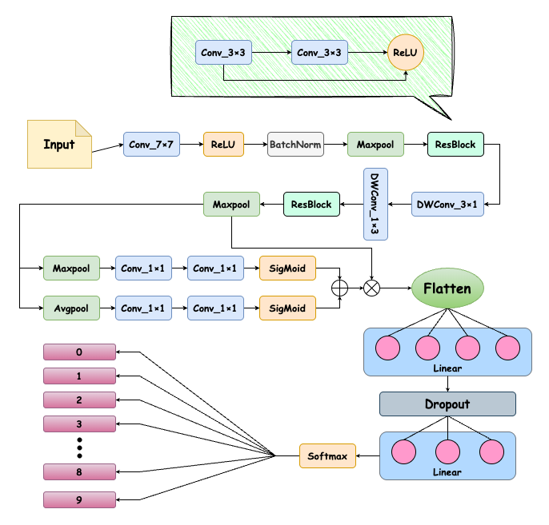

# HZAU_2025-深度学习与神经网络课程实验二：MNIST 手写数字识别卷积神经网络模型

## 项目简介
本项目基于原始卷积神经网络实现MNIST数据集手写数字识别任务的代码，完善了项目的整体架构，增加了一些有趣的新功能。

---

## 🚀 项目功能与特点

- **训练与测试分离**：
  - 将模型定义、训练过程和测试过程分开，保留模型定义的训练功能。
  
- **卷积神经网络结构**：
  - 输入层 → 卷积层 (32个特征图，7x7卷积核) → ReLU 激活 → 最大池化层 (2x2) → 卷积层 (64个特征图，5x5卷积核) → ReLU 激活 → 最大池化层 (2x2) → 展平层 → 全连接层 (1024维) → ReLU 激活 → Dropout (保留概率 `keep_prob`) → 全连接层 (10类) → Softmax 激活。
  - 使用交叉熵损失函数。

- **改进后的网络结构**：
  - **卷积层**：
    - 初始卷积层：输入1通道图像，经过7x7卷积核，输出32个特征图，ReLU激活，BatchNorm标准化，2x2最大池化。
    - 第二个卷积层：使用`ResBlock`（残差块），将32个特征图转换为64个特征图。
    - 第三个卷积层：使用深度卷积（Depthwise Convolution），输出64个通道，卷积核大小为(1, 3)和(3, 1)，可以提取空间特征。
    - 第四个卷积层：使用`ResBlock`（残差块），将64个特征图转换为128个特征图。
    - **自适应池化层**：使用`AdaptiveAvgPool2d`，将输出池化为1x1的大小。
  - **改进部分**：
    - **残差块**（`ResBlock`）：通过添加跳跃连接，解决了训练深度网络时的梯度消失问题，提高了训练效率。
    - **深度卷积**（`DwConv`）：使用深度卷积层代替标准卷积，减少了参数量并提高了计算效率，卷积核大小为(1, 3)和(3, 1)。
    - **通道注意力模块**（`Channel`）：结合了平均池化和最大池化分支，使用Sigmoid激活函数对每个通道进行加权，从而增强了网络对重要通道的关注。
  - **全连接层和Dropout**：
    - 使用全连接层（1024维）进行特征压缩，然后通过Dropout层进行正则化，最后输出10类结果，使用Softmax激活函数。

- **改进优势**：
  - **减少参数量**：深度卷积（Depthwise Convolution）减少了计算复杂度。
  - **提高特征提取能力**：使用残差块和通道注意力模块，提高了网络对重要特征的提取能力。
  - **防止过拟合**：通过使用Dropout正则化，并增加了BatchNorm来缓解过拟合问题。
  - **更高效的计算**：结合深度卷积和通道注意力模块，使网络在处理时更为高效，同时保留了较好的性能。

- **日志文件**：
  - 2025.3.24更新：我们全新引入了日志记录功能！支持自动记录训练网络的输出，再也不错过任何一个SOTA！

- **权重文件存储与加载**：
  - 提供简单的权重保存与加载机制，方便复用已训练的权重。
  
- **模型比较与性能分析**：
  - **目标**：
    - 比较改进后的网络（`improve_Net`）和原始网络（`Net`）的结构、参数量和计算复杂度（FLOPs）。
  - **功能描述**：
    - 使用`torchsummary`库来输出模型的参数概览，展示网络的层级结构和每层的参数数量。
    - 使用`thop`库来计算模型的浮点运算次数（FLOPs）和参数量，评估模型的计算效率。
  - **输出**：
    - 输出改进网络和原始网络的详细结构、参数量、FLOPs以及每个模型的计算性能。

- **训练过程可视化**：
  - **目标**：绘制训练过程中损失（Loss）和准确率（Accuracy）的变化曲线。
  - **功能描述**：
    - `plot_metrics` 函数接受训练历史数据，绘制训练和测试的损失曲线及准确率曲线。
    - 支持将生成的图表保存到指定路径。
  
- **分类结果可视化**：
  - **目标**：可视化模型对测试数据的分类预测结果。
  - **功能描述**：
    - `visualize_predictions` 函数从数据加载器中获取测试样本，利用训练好的模型进行预测。
    - 显示图像及其真实标签和预测标签，支持指定显示的样本数量。
    - 支持将生成的图像保存到指定路径。
- **K折交叉验证训练**：
  - **目标**：使用K折交叉验证评估模型在多个数据子集上的性能，确保模型的泛化能力。
  - **功能描述**：
    - 使用`KFold`进行数据集的划分，设置`K_FOLDS`（默认为5折）来进行K折交叉验证。
    - 在每一折中，模型会分别在训练集上训练，在验证集上验证其性能，计算并记录每一折的准确率。
    - 每一折的训练过程使用`AdamW`优化器，结合交叉熵损失函数（`CrossEntropyLoss`）进行优化。
    - 使用`logger`记录每一折的训练损失、训练准确率和验证准确率。
  - **输出结果**：
    - 每一折的训练过程和验证过程中的损失和准确率都会被记录。
    - 交叉验证完成后，绘制每一折验证准确率的曲线，并将图像保存到指定路径（`logs/img/cv_accuracy.png`）。
    - 日志记录保存了每一折的详细信息，包括每个epoch的训练过程以及验证结果。
  - **优势**：
    - 通过K折交叉验证评估模型性能，可以更好地了解模型在不同数据划分上的表现，减少单一训练/验证划分可能带来的误差。
    - 日志记录和可视化帮助更好地分析模型训练过程和性能。
    
- **超参数搜索与训练过程可视化**：
  - **目标**：通过不同的批量大小（`batch_size`）和学习率（`learning_rate`）组合，进行超参数搜索，评估其对模型准确率的影响。
  - **功能描述**：
    - 通过遍历多个批量大小和学习率的组合，训练模型并计算每个组合对应的测试集准确率。
    - 每一轮训练后，使用`AdamW`优化器和交叉熵损失函数对模型进行优化。
    - 记录每个超参数组合的最佳准确率，并将结果存储。
    - 训练完成后，使用三维散点图（`3D scatter plot`）显示不同超参数组合下的准确率，其中X轴为批量大小，Y轴为学习率，Z轴为准确率。
    - 可视化结果有助于选择最优的超参数配置。

  - **输出结果**：
    - 绘制三维散点图，显示不同批量大小和学习率组合下的测试集准确率。
    - 将图像保存到指定路径（`./logs/img`）。
---

## 📂 项目结构

```
/project_root
│── data/                            # 数据存储路径
│── logs/                            # 日志文件保存路径
│── weights/                         # 预训练权重保存路径
│── ex2.py                            # 模型定义文件
│── flops.py                          # 计算FLOPs的脚本
│── improve_ex2.py                    # 改进后的模型定义
│── logger.py                         # 日志记录脚本
│── README.md                         # 项目自述文件
│── requirements.txt                  # 项目运行所需的依赖文件
│── test.py                           # 测试脚本
│── train_crossz.py                   # k折交叉验证训练脚本
│── train_improve.py                  # 改进后的训练脚本
│── train.py                          # 模型训练脚本
│── train2.py                         # 超参数搜索训练脚本
│── visualization.py                  # 可视化脚本
```

---

## ⚙️ 使用说明

本实验采用单卡Nvidia-3090进行训练

### ① 环境准备
```bash
pip install -r requirements.txt
```

### ② 训练模型

```bash
python train.py
```
- **使用改进模型进行训练**：
```bash
python train_improve.py
```
- **k折交叉验证训练**：
```bash
python train_crossz.py
```
- **超参数优化训练与可视化**：
```bash
python train2.py
```

### ③ 测试并可视化结果
```bash
python test.py <model_path> 
```
- **如：**
```bash
python test.py ./weights/best_mnist_cnn.pth
```
### ④ 计算浮点运算量与参数量
```bash
python flops.py
```

---
## 📌 输出结果说明

- 模型训练时，loss和accuracy曲线将自动保存至`./logs/img/training_curve.png`。
- 训练好的权重将保存在`weight/`目录中，会自动保存最佳权重和最后一轮训练的权重。
- 测试时预测结果图片保存在指定路径（默认：`./logs/img/predictions.png`）。
- k折交叉验证的图像将保存在（默认：`./logs/img/cv_accuracy.png`）。
- 超参数优化图像将保存在`./logs/img/train2.png`

---

## 🎯 未来改进方向
- 我有一个绝妙的想法，可惜 Cuda Out of Memory

---

🎉 **有雪吧 让记忆景象更深远**
