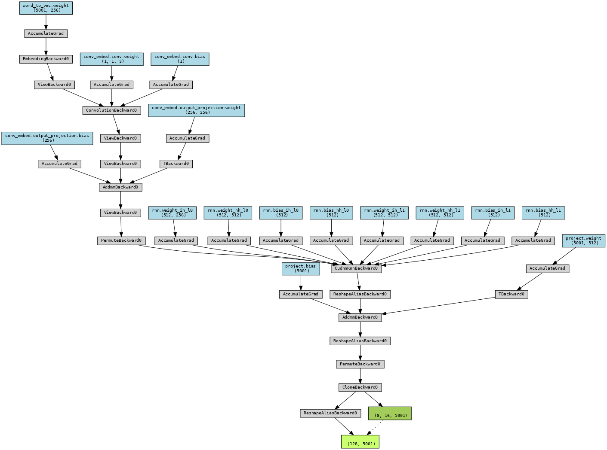
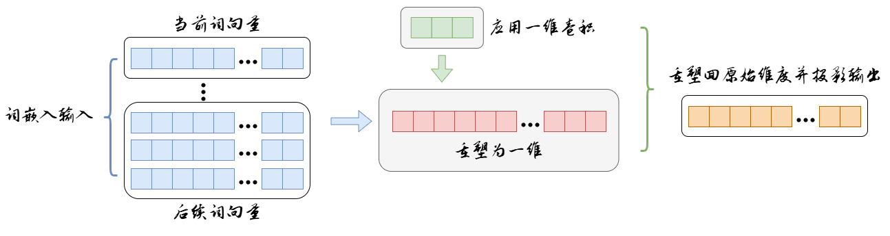
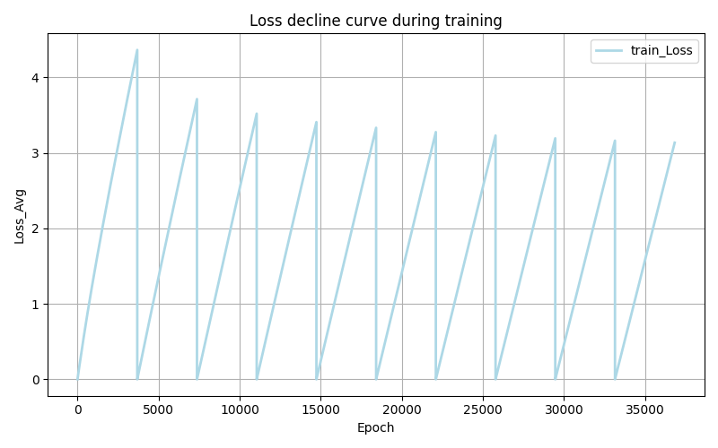

# HZAU_2025-深度学习与神经网络课程实验三：基于卷积增强的循环神经网络（RNN）古诗生成模型

本项目构建了一个基于循环神经网络（RNN）的古诗生成系统，并逐步改进模型结构，引入了卷积嵌入模块以提升文本生成的连贯性与上下文表达能力，我们特别引入了一些有趣的新功能。

## ✨ 项目亮点

- 支持字符级古诗生成任务
- 提供原始 RNN 模型与增强版 ConvRNN 模型
- 采用卷积对词嵌入进行局部特征建模

- 提供训练与采样脚本
- 提供结构可视化工具，直观展示模型工作机制


## 📁 项目结构

```
├── model_ori.py        # 原始 RNN 模型（训练 + 预测一体）
├── model.py            # 拆分后的基础 RNN 模型结构
├── improve_model.py    # 引入卷积嵌入的增强型模型
├── train.py            # 基础 RNN 模型训练脚本
├── train2.py           # 增强型模型训练脚本（带参数配置）
├── test.py             # 基础模型的测试与采样
├── test2.py            # 改进模型的测试与采样（支持温度调节）
├── vision.py           # 模型结构与计算图可视化
├── poetry.txt          # 训练语料（古诗）
├── requirements.txt    # 依赖文件
└── weights/            # 保存模型参数和词表的目录
```

## 🚀 快速开始

### 安装依赖

```bash
pip install -r requirements.txt
```

如遇 `graphviz` 报错，请确保你已安装系统依赖：
- Linux: `sudo apt install graphviz`
- Windows: 下载 [Graphviz](https://graphviz.org/download/)，并将 `bin` 添加到系统 PATH

### 训练模型

#### 训练基础模型：

```bash
python train.py
```

#### 训练增强模型：

```bash
python train2.py \
    --text_path ./poetry.txt \
    --batch_size 256 \
    --embedding_dim 256 \
    --hidden_size 512 \
    --epochs 10
```

### 生成古诗

#### 使用基础模型：

```bash
python test.py
```

#### 使用增强模型（可调温度）：

```bash
python test2.py \
    --model_path weights/improve_checkpoints/model_final.pth \
    --converter_path weights/improve_checkpoints/text_converter.pth \
    --start_text "春" \
    --length 100 \
    --temperature 0.8
```

### 模型可视化

```bash
python vision.py
```

将生成以下图片：
- `model_architecture.png`: 计算图
- `network_diagram.png`: 模型结构总览图
- `conv_embedding_diagram.png`: 卷积嵌入层结构图

## 🧠 模型结构说明

- 词嵌入层：将字符转换为向量表示
- 卷积嵌入层：在嵌入上进行局部卷积，提取上下文特征
- 多层 RNN：建模序列关系
- 线性输出层：预测下一个字符

##  ✿ 训练效果


## 📜 开源协议

本项目采用 MIT 协议，欢迎学习、修改与二次开发。

---

如你觉得项目有帮助，欢迎 Star 🌟 或 Fork 🍴！  
```bash
git clone https://github.com/yourusername/poetry-rnn-enhanced
```

🎉 **留住温度、速度，温柔或愤怒**

